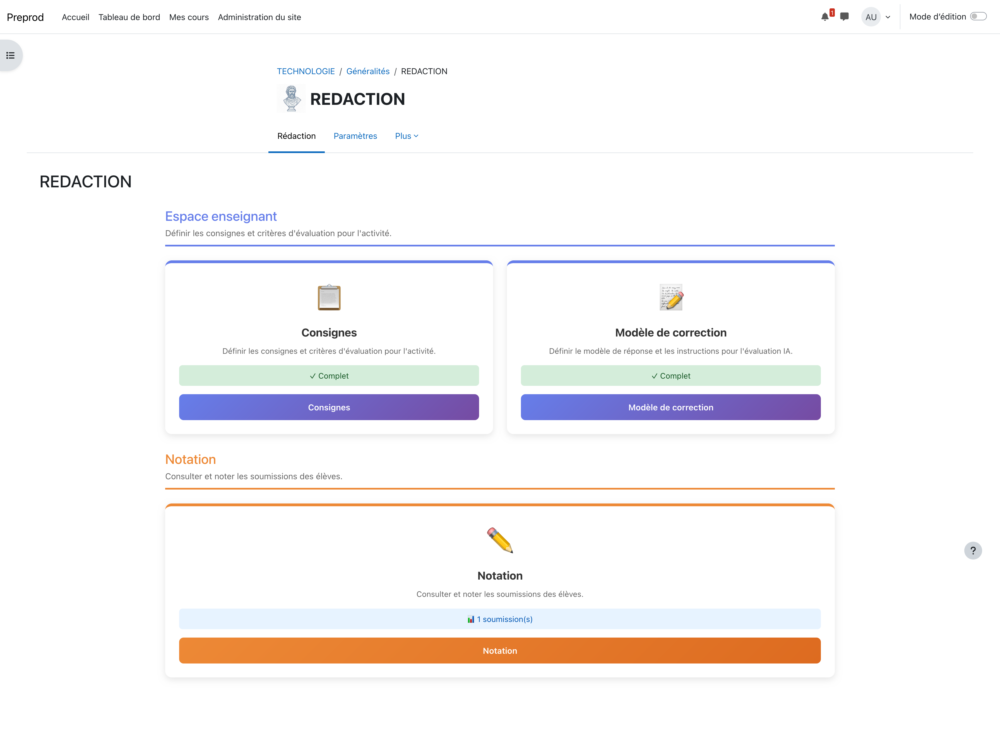
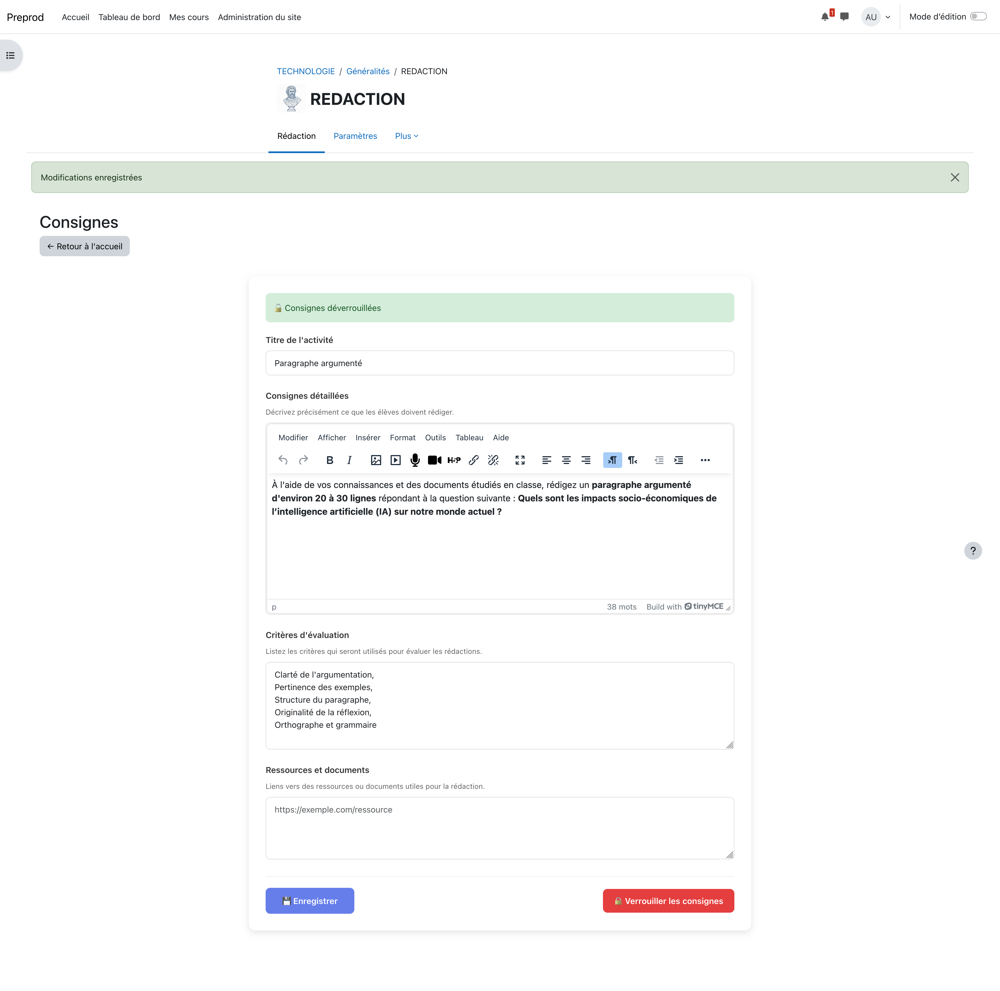
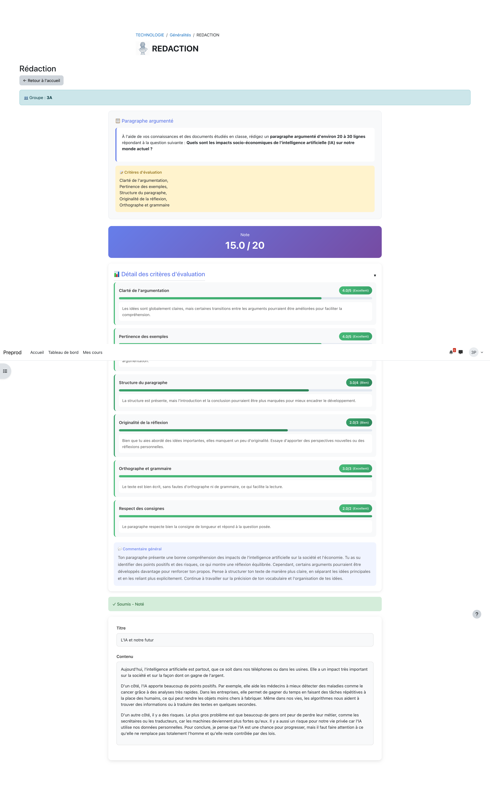

# mod_redaction - Module de Rédaction pour Moodle

Plugin Moodle permettant aux enseignants de proposer des activités de rédaction de texte avec évaluation manuelle ou assistée par IA.

## Fonctionnalités

### Pour les enseignants

- **Page Consignes** : Définir un titre, des instructions détaillées, des critères d'évaluation et des ressources documentaires
- **Verrouillage des consignes** : Empêcher les modifications une fois l'activité lancée
- **Modèle de correction** : Fournir un exemple de réponse attendue et des instructions spécifiques pour l'IA
- **Éditeur visuel de critères** : Interface drag & drop pour construire la grille de notation (total /20 en temps réel)
- **Dates de soumission** : Configurer une date attendue et une date limite
- **Interface de notation** : Noter manuellement ou appliquer les notes générées par l'IA
- **Frise chronologique d'entraînement** : Visualiser la progression de chaque élève via une timeline interactive avec sparkline, curseur déplaçable et détail par tentative
- **Navigation fluide** : Passer d'un élève/groupe à l'autre avec les boutons précédent/suivant

### Pour les élèves

- **Rédaction en ligne** : Éditeur de texte avec compteur de mots en temps réel
- **Sauvegarde automatique** : Aucune perte de travail grâce à l'autosave configurable
- **Mode entraînement** : Soumettre plusieurs versions pour recevoir un feedback IA avant la soumission finale (cooldown, nombre max de tentatives configurable)
- **Consultation des consignes** : Accès permanent aux instructions et critères
- **Soumission sécurisée** : Confirmation avant soumission définitive
- **Affichage de la note** : Visualisation de la note et des commentaires après correction

### Évaluation par IA

Le plugin supporte 4 fournisseurs d'IA :

| Fournisseur | Configuration requise |
|-------------|----------------------|
| **OpenAI** (GPT-4) | Clé API utilisateur |
| **Anthropic** (Claude) | Clé API utilisateur |
| **Mistral AI** | Clé API utilisateur |
| **Albert** (Etalab) | Clé intégrée (aucune configuration) |

L'évaluation IA génère :
- Une note sur 20
- Un commentaire détaillé
- Des scores par critère
- Des mots-clés identifiés/manquants
- Des suggestions d'amélioration

### Modes de travail

- **Mode individuel** : Chaque élève travaille seul sur sa rédaction
- **Mode groupe** : Les membres d'un groupe partagent une rédaction commune

## Captures d'écran

### Page d'accueil


### Consignes enseignant


### Feedback et évaluation IA


## Prérequis

- Moodle 5.0 ou supérieur (version 2024100700+)
- PHP 8.1 ou supérieur

## Installation

1. Télécharger le plugin
2. Extraire dans `/mod/redaction/`
3. Se connecter en tant qu'administrateur
4. Suivre les instructions de mise à niveau
5. Configurer les paramètres si nécessaire

```bash
# Via Git
cd /path/to/moodle/mod
git clone https://github.com/votre-repo/mod_redaction.git redaction
```

## Configuration

### Paramètres de l'activité

Lors de la création d'une activité Rédaction :

| Paramètre | Description | Valeur par défaut |
|-----------|-------------|-------------------|
| Soumission par groupe | Travail collectif ou individuel | Oui |
| Intervalle de sauvegarde | Fréquence d'autosave (secondes) | 30 |
| Évaluation IA | Activer l'assistance IA | Non |
| Fournisseur IA | Service d'IA à utiliser | - |
| Clé API | Clé pour le fournisseur choisi | - |
| Application automatique | Appliquer les notes IA sans validation | Non |
| Mode entraînement | Permettre les soumissions itératives | Non |
| Cooldown entraînement | Délai entre deux tentatives (secondes) | 900 |
| Changement minimum | % de modification requis entre tentatives | 10 |
| Tentatives max | Nombre max de soumissions d'entraînement (0=illimité) | 5 |

### Configuration Albert (Etalab)

Pour utiliser Albert (IA souveraine française), aucune configuration n'est requise. Le plugin utilise une clé API intégrée.

### Configuration des autres fournisseurs

1. Créer un compte sur le site du fournisseur
2. Générer une clé API
3. Saisir la clé dans les paramètres de l'activité

## Structure de la base de données

Le plugin crée 6 tables :

| Table | Description |
|-------|-------------|
| `redaction` | Instances du module |
| `redaction_consignes` | Consignes enseignant |
| `redaction_submission` | Soumissions élèves |
| `redaction_correction` | Modèle de correction |
| `redaction_ai_evaluations` | Résultats des évaluations IA |
| `redaction_history` | Historique des versions |

## Capacités (Permissions)

| Capacité | Rôle par défaut | Description |
|----------|-----------------|-------------|
| `mod/redaction:addinstance` | Manager | Créer une activité |
| `mod/redaction:view` | Tous | Voir l'activité |
| `mod/redaction:editconsignes` | Enseignant | Modifier les consignes |
| `mod/redaction:submit` | Élève | Soumettre une rédaction |
| `mod/redaction:viewallsubmissions` | Enseignant | Voir toutes les soumissions |
| `mod/redaction:grade` | Enseignant | Noter les rédactions |
| `mod/redaction:viewhistory` | Enseignant | Voir l'historique des versions |

## Architecture technique

```
mod_redaction/
├── ajax/                    # Endpoints AJAX
│   ├── autosave.php        # Sauvegarde automatique
│   ├── submit.php          # Soumission/déverrouillage
│   ├── evaluate.php        # Déclenchement évaluation IA
│   ├── apply_ai_grade.php  # Application note IA
│   ├── generate_criteria.php # Génération critères par IA
│   ├── training_submit.php # Soumission entraînement
│   ├── get_evaluation_status.php
│   └── get_history.php
├── amd/src/                 # Modules JavaScript AMD
│   ├── autosave.js
│   ├── grading_actions.js
│   ├── dashboard.js
│   └── training_timeline.js # Frise chronologique interactive
├── classes/                 # Classes PHP (autoload)
│   ├── ai_config.php
│   ├── ai_evaluator.php
│   ├── ai_prompt_builder.php
│   ├── ai_response_parser.php
│   ├── ai_provider/        # Fournisseurs IA
│   │   ├── provider_interface.php
│   │   ├── base_provider.php
│   │   ├── openai_provider.php
│   │   ├── anthropic_provider.php
│   │   ├── mistral_provider.php
│   │   └── albert_provider.php
│   ├── dashboard/           # Tableau de bord enseignant
│   │   ├── ai_summary_generator.php
│   │   ├── submission_stats.php
│   │   └── token_stats.php
│   ├── event/               # Événements Moodle
│   │   ├── ai_evaluation_completed.php
│   │   ├── ai_evaluation_requested.php
│   │   ├── ai_grade_applied.php
│   │   ├── course_module_viewed.php
│   │   └── grade_updated.php
│   ├── privacy/
│   │   └── provider.php
│   └── task/
│       └── evaluate_submission.php
├── db/
│   ├── install.xml         # Schéma de base de données
│   ├── access.php          # Capacités
│   └── upgrade.php         # Migrations
├── lang/
│   ├── en/redaction.php    # Anglais
│   └── fr/redaction.php    # Français
├── templates/               # Templates Mustache
│   ├── ai_evaluation.mustache
│   ├── dashboard_teacher.mustache
│   ├── grading_form.mustache
│   ├── grading_navigation.mustache
│   ├── history_modal.mustache
│   ├── submission_panel.mustache
│   └── training_timeline.mustache
├── pages/
│   ├── home.php            # Page d'accueil
│   ├── consignes.php       # Consignes enseignant
│   ├── correction_model.php # Modèle de correction
│   └── redaction.php       # Rédaction élève
├── grading.php             # Interface de notation
├── lib.php                 # Fonctions principales
├── mod_form.php            # Formulaire de création
├── version.php             # Métadonnées
└── view.php                # Routeur principal
```

## Workflow d'évaluation IA

```
1. Enseignant déclenche l'évaluation
   ↓
2. Création d'un enregistrement (status: pending)
   ↓
3. Tâche adhoc mise en file d'attente
   ↓
4. Cron exécute la tâche (status: processing)
   ↓
5. Appel API au fournisseur IA
   ↓
6. Parsing de la réponse JSON
   ↓
7. Stockage des résultats (status: completed)
   ↓
8. Enseignant applique la note (status: applied)
```

## Personnalisation des prompts

Le `ai_prompt_builder.php` construit les prompts pour l'IA. Par défaut, 4 critères sont utilisés :

1. **Pertinence** (5 pts) - Réponse adaptée au sujet
2. **Structure** (5 pts) - Organisation logique
3. **Expression** (5 pts) - Qualité de l'écriture
4. **Argumentation** (5 pts) - Qualité des arguments

Les enseignants peuvent personnaliser les critères via la grille JSON dans le modèle de correction :

```json
[
  {"name": "Pertinence", "weight": 5, "description": "Réponse pertinente au sujet"},
  {"name": "Structure", "weight": 5, "description": "Organisation logique"},
  {"name": "Expression", "weight": 5, "description": "Qualité de l'expression"},
  {"name": "Argumentation", "weight": 5, "description": "Qualité des arguments"}
]
```

## Dépannage

### L'évaluation IA échoue

1. Vérifier la clé API dans les paramètres de l'activité
2. Consulter les logs Moodle (`Rapports > Journaux`)
3. Vérifier la connectivité réseau vers l'API
4. Tester la connexion via le bouton dédié

### La sauvegarde automatique ne fonctionne pas

1. Vérifier que JavaScript est activé
2. Ouvrir la console développeur (F12) pour les erreurs
3. Purger les caches Moodle

### Les notes n'apparaissent pas dans le carnet

1. Vérifier que la note a bien été enregistrée
2. Recalculer le carnet de notes
3. Vérifier les paramètres de visibilité du carnet

## Développement

### Compiler les modules JavaScript

```bash
cd /path/to/moodle
grunt amd
```

### Purger les caches

```bash
php admin/cli/purge_caches.php
```

### Exécuter le cron manuellement

```bash
php admin/cli/cron.php
```

## Licence

Ce plugin est distribué sous licence [GNU GPL v3](http://www.gnu.org/copyleft/gpl.html).

## Auteur

**Emmanuel REMY**
Copyright 2026

## Changelog

### Version 1.2.0 (2026-02-10)

- **Mode entraînement** : les élèves peuvent soumettre plusieurs fois pour recevoir un feedback IA itératif avant la soumission finale
  - Cooldown configurable entre tentatives
  - Pourcentage minimum de modification exigé
  - Nombre maximum de tentatives (ou illimité)
- **Frise chronologique d'entraînement** : vue enseignant interactive montrant la répartition temporelle des tentatives
  - Sparkline SVG de la progression des notes
  - Curseur déplaçable (souris/tactile/clavier)
  - Panneau de détail par tentative (critères, feedback)
  - Indicateur de tendance (↑ ↓ →)
  - Fallback liste simple sans JavaScript
- **Éditeur visuel de critères** : remplacement du textarea JSON par un formulaire interactif
  - Ajout/suppression dynamique de critères
  - Total des poids en temps réel (vert si = 20)
  - Génération IA de la grille de critères
- **Sécurité** : re-chiffrement des clés API legacy (base64 → `\core\encryption`)
- **Événements Moodle** : ai_evaluation_completed, ai_evaluation_requested, ai_grade_applied, grade_updated
- **Backup/restore** : support complet des champs training et is_training
- Application différée des notes IA (champ `scheduled_apply_at`)

### Version 1.1.0 (2026-01-28)

- Affichage détaillé des critères d'évaluation IA sur la page élève
- Affichage détaillé des critères d'évaluation IA sur la page enseignant
- Indicateurs de niveau (Excellent, Bien, À améliorer, Insuffisant)
- Barres de progression visuelles pour chaque critère
- Commentaires individuels par critère
- Sections pliables pour une meilleure ergonomie
- Génération automatique des critères d'évaluation par IA

### Version 1.0.0 (2026-01-28)

- Version initiale
- Support de 4 fournisseurs IA (OpenAI, Anthropic, Mistral, Albert)
- Modes individuel et groupe
- Sauvegarde automatique
- Historique des versions
- Interface de notation complète
- Intégration avec le carnet de notes Moodle
